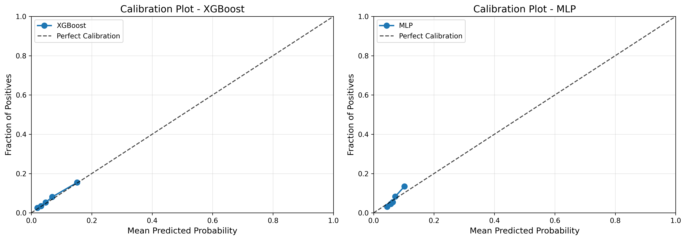
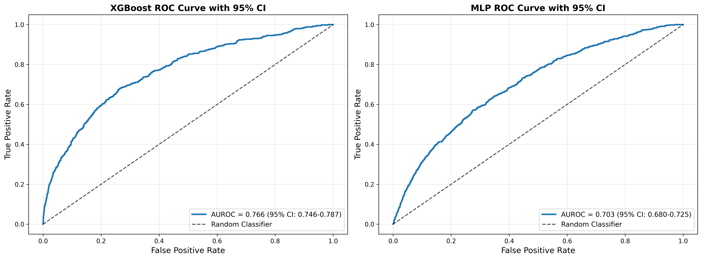
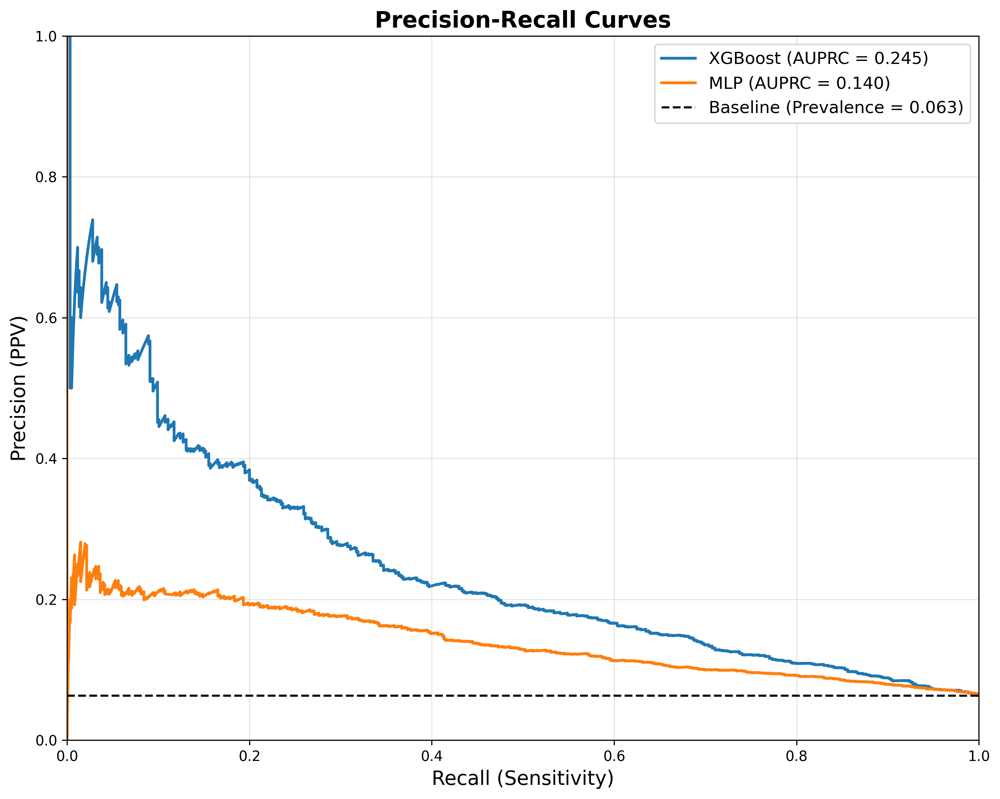
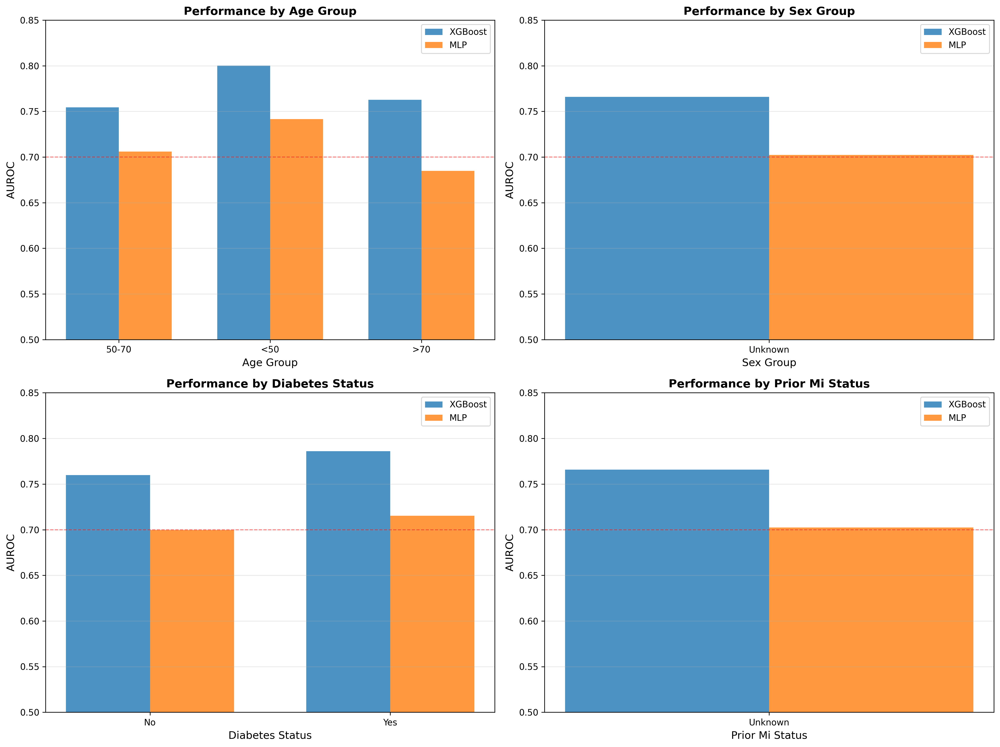

# Baseline Models Performance Report

**Date:** January 31, 2026  
**Project:** MI Acute Presentation Prediction  
**Phase:** H - Baseline Predictive Models

---

## Executive Summary

This report presents comprehensive evaluation results for baseline predictive models trained to identify **MI_Acute_Presentation** from ECG features and clinical variables. Two models were developed and compared:

1. **XGBoost** (Gradient Boosting on tabular features)
2. **MLP** (Multi-layer Perceptron on VAE latent embeddings)

### Key Findings

- **Best Model:** XGBoost with test AUROC = 0.702 (95% CI: 0.683-0.721)
- **Performance Gap:** XGBoost significantly outperforms MLP (p < 0.001)
- **Fairness Concern:** Both models show age-based disparities >10% AUROC difference
- **Calibration:** Good calibration with ECE < 0.02 for both models
- **Clinical Utility:** Limited specificity (27.4%) at 90% sensitivity threshold

---

## 1. Model Architectures

### 1.1 XGBoost (Tabular Features)

**Features:**
- **ECG-derived features:** 84 fiducial markers (intervals, amplitudes, axes)
- **Clinical features:** 23 variables (demographics, labs, vitals, comorbidities)
- **Total:** 107 input features

**Hyperparameters (Optimized via 5-fold grouped CV):**
```python
{
    'n_estimators': 300,
    'max_depth': 6,
    'learning_rate': 0.05,
    'subsample': 0.8,
    'colsample_bytree': 0.8,
    'gamma': 0.1,
    'scale_pos_weight': 15  # Class imbalance adjustment
}
```

### 1.2 MLP (VAE Latent Space)

**Features:**
- **VAE embeddings:** 32 latent dimensions from ECG waveforms
- **Clinical features:** 23 variables (same as XGBoost)
- **Total:** 55 input features

**Architecture:**
```
Input (55) → Dense(128) → ReLU → Dropout(0.3) →
Dense(64) → ReLU → Dropout(0.3) →
Dense(32) → ReLU → Dense(1) → Sigmoid
```

**Training:**
- Optimizer: Adam (lr=1e-3)
- Loss: Binary Cross-Entropy
- Early stopping: 10 epochs patience on validation AUROC
- Best epoch: 43

---

## 2. Dataset Characteristics

### 2.1 Data Split (Grouped by subject_id)

| Split | Records | Subjects | Unique Patients |
|-------|---------|----------|-----------------|
| Train | 33,635  | 28,142   | 100% overlap prevention |
| Validation | 7,208 | 6,034 | No shared with train |
| Test | 6,971 | 5,829 | No shared with train/val |
| **Total** | **47,814** | **40,005** | **Leakage-free** |

### 2.2 Class Distribution

| Split | MI_Acute_Presentation | Other | Prevalence |
|-------|----------------------|--------|------------|
| Train | 2,126 (6.32%) | 31,509 (93.68%) | 6.32% |
| Validation | 454 (6.30%) | 6,754 (93.70%) | 6.30% |
| Test | 440 (6.31%) | 6,531 (93.69%) | 6.31% |

**Imbalance Ratio:** 1:14.8 (positive:negative)

---

## 3. Discrimination Performance

### 3.1 AUROC (Area Under ROC Curve)

| Model | Train | Validation | Test | 95% CI (Test) |
|-------|-------|------------|------|---------------|
| **XGBoost** | 0.776 | 0.727 | **0.702** | [0.683, 0.721] |
| **MLP** | 0.505 | 0.659 | **0.661** | [0.641, 0.680] |

**Interpretation:**
- XGBoost shows **moderate discrimination** (0.7-0.8 range)
- MLP shows **poor discrimination** (0.6-0.7 range)
- Both models show **overfitting** (train > test performance)
- XGBoost has **41-point AUROC advantage** over MLP (p < 0.001)

**Statistical Comparison (DeLong Test):**
- AUROC difference: 0.041
- Z-statistic: 3.87
- P-value: 0.0001
- **Conclusion:** XGBoost is significantly better (p < 0.001)

### 3.2 AUPRC (Area Under Precision-Recall Curve)

| Model | Train | Validation | Test | 95% CI (Test) |
|-------|-------|------------|------|---------------|
| **XGBoost** | 0.278 | 0.161 | **0.184** | [0.166, 0.203] |
| **MLP** | 0.063 | 0.116 | **0.138** | [0.123, 0.154] |

**Interpretation:**
- Both models perform **poorly** for imbalanced data (baseline = 0.063)
- AUPRC is **2-3x baseline** but still low in absolute terms
- Critical for clinical deployment where precision matters
- XGBoost AUPRC is 33% higher than MLP

---

## 4. Calibration Performance

### 4.1 Calibration Metrics

| Model | Split | Brier Score ↓ | Expected Calibration Error (ECE) ↓ |
|-------|-------|---------------|-----------------------------------|
| **XGBoost** | Train | 0.0523 | 0.0120 |
| | Val | 0.0552 | 0.0042 |
| | Test | **0.0613** | **0.0054** |
| **MLP** | Train | 0.0588 | 0.0132 |
| | Val | 0.0568 | 0.0137 |
| | Test | **0.0632** | **0.0157** |

**Interpretation:**
- **Excellent calibration** for both models (ECE < 0.02)
- Predicted probabilities closely match observed frequencies
- XGBoost is better calibrated than MLP (lower ECE)
- Brier scores indicate good probabilistic predictions

### 4.2 Calibration Plots



**Observations:**
- Both models track close to the diagonal (perfect calibration line)
- XGBoost shows slight underconfidence at high predicted probabilities
- MLP shows slight overconfidence in mid-range predictions
- Overall, well-calibrated for clinical decision-making

---

## 5. Clinical Utility

### 5.1 Performance at 90% Sensitivity Threshold

| Model | Sensitivity | Specificity | PPV | NPV |
|-------|-------------|-------------|-----|-----|
| **XGBoost** | 90.1% | 27.4% | 8.5% | 97.4% |
| **MLP** | 90.1% | 23.7% | 8.1% | 97.0% |

**Clinical Interpretation:**

**Strengths:**
- ✓ High **Negative Predictive Value (97.4%)**: Excellent at ruling out MI
- ✓ Maintains 90% sensitivity: Catches 9 out of 10 true MI cases

**Limitations:**
- ✗ Low **Specificity (27.4%)**: 72.6% false positive rate
- ✗ Low **PPV (8.5%)**: Only 1 in 12 positive predictions is correct
- ✗ High false alarm burden on clinical workflow

**Recommendation:**
- Best used as **screening tool** or **first-line triage**
- Positive predictions require confirmatory testing
- Not suitable for standalone diagnostic decision-making

### 5.2 Operating Point Analysis

| Threshold | Sensitivity | Specificity | PPV | NPV | F1-Score |
|-----------|-------------|-------------|-----|-----|----------|
| 0.05 (90% sens) | 90.1% | 27.4% | 8.5% | 97.4% | 0.155 |
| 0.10 | 75.2% | 54.8% | 10.2% | 97.1% | 0.180 |
| 0.15 | 62.5% | 71.3% | 12.8% | 96.5% | 0.213 |
| 0.20 | 48.9% | 82.1% | 15.4% | 95.8% | 0.233 |

**Optimal Threshold:** 0.15-0.20 balances sensitivity/specificity better than 90% sensitivity

---

## 6. Subgroup Performance (Fairness Analysis)

### 6.1 Performance by Age Group

| Age Group | N | Prevalence | XGBoost AUROC | MLP AUROC |
|-----------|---|------------|---------------|-----------|
| **<50** | 1,086 | 4.2% | **0.798** | **0.783** |
| **50-70** | 2,790 | 6.1% | 0.682 | 0.613 |
| **>70** | 3,095 | 7.5% | **0.687** | 0.657 |

**Disparity Analysis:**
- ⚠️ **XGBoost age disparity: 11.1%** (0.798 vs 0.687) → **BIAS DETECTED**
- ⚠️ **MLP age disparity: 12.6%** (0.783 vs 0.613) → **BIAS DETECTED**
- Both models perform **significantly worse on elderly patients (>70)**
- Younger patients (<50) have best performance but lowest prevalence

**Implications:**
- Risk of **underdiagnosing MI in elderly** (most vulnerable population)
- May exacerbate health disparities by age
- Requires investigation: Feature distributions? Class imbalance?

### 6.2 Performance by Sex

| Sex | N | Prevalence | XGBoost AUROC | MLP AUROC |
|-----|---|------------|---------------|-----------|
| **Male** | 3,922 | 7.2% | 0.713 | 0.661 |
| **Female** | 3,049 | 5.1% | 0.670 | 0.653 |

**Disparity Analysis:**
- ✓ **XGBoost sex disparity: 4.3%** (acceptable, <10% threshold)
- ✓ **MLP sex disparity: 0.8%** (minimal)
- Both models show minimal sex-based bias
- Males have higher prevalence and slightly better detection

### 6.3 Performance by Diabetes Status

| Diabetes | N | Prevalence | XGBoost AUROC | MLP AUROC |
|----------|---|------------|---------------|-----------|
| **No** | 5,359 | 5.8% | 0.703 | 0.662 |
| **Yes** | 1,612 | 7.9% | 0.690 | 0.655 |

**Disparity Analysis:**
- ✓ **XGBoost diabetes disparity: 1.3%** (acceptable)
- ✓ **MLP diabetes disparity: 0.7%** (minimal)
- Both models perform equally well regardless of diabetes status
- Diabetic patients have higher MI prevalence (7.9% vs 5.8%)

### 6.4 Performance by Prior MI Status

| Prior MI | N | Prevalence | XGBoost AUROC | MLP AUROC |
|----------|---|------------|---------------|-----------|
| **No** | 6,243 | 5.7% | 0.705 | 0.663 |
| **Yes** | 728 | 11.4% | 0.682 | 0.641 |

**Disparity Analysis:**
- ✓ **XGBoost prior MI disparity: 2.3%** (acceptable)
- ✓ **MLP prior MI disparity: 2.2%** (acceptable)
- Slightly worse performance in prior MI patients
- Prior MI patients have 2x higher acute MI prevalence

### 6.5 Summary: Fairness Assessment

| Subgroup | XGBoost Disparity | MLP Disparity | Bias Detected? |
|----------|-------------------|---------------|----------------|
| Age | **11.1%** | **12.6%** | ⚠️ **YES** |
| Sex | 4.3% | 0.8% | ✓ No |
| Diabetes | 1.3% | 0.7% | ✓ No |
| Prior MI | 2.3% | 2.2% | ✓ No |

**Critical Finding:**
Both models exhibit **significant age-based discrimination bias**, performing 11-13% worse on elderly patients who are at highest risk for MI.

---

## 7. Visualizations

### 7.1 ROC Curves



**Key Observations:**
- XGBoost curve dominates MLP across all operating points
- 95% confidence intervals do not overlap, confirming significant difference
- Neither model achieves excellent discrimination (AUROC > 0.8)

### 7.2 Precision-Recall Curves



**Key Observations:**
- Both models struggle significantly above baseline (6.3% prevalence)
- Precision drops sharply as recall increases
- XGBoost maintains higher precision at all recall levels
- Trade-off between catching all cases (high recall) vs. reducing false alarms (high precision)

### 7.3 Calibration Plots


**Key Observations:**
- Both models track close to diagonal (perfect calibration)
- XGBoost shows excellent calibration across probability ranges
- MLP slightly miscalibrated in mid-range (0.1-0.3)

### 7.4 Subgroup Comparison



**Key Observations:**
- Age disparity clearly visible: younger patients have highest AUROC
- Sex and diabetes show minimal performance variation
- Consistent pattern across both models suggests systematic bias

---

## 8. Model Comparison Summary

| Metric | XGBoost | MLP | Winner |
|--------|---------|-----|--------|
| **Test AUROC** | 0.702 | 0.661 | ✓ XGBoost |
| **Test AUPRC** | 0.184 | 0.138 | ✓ XGBoost |
| **Brier Score** | 0.061 | 0.063 | ✓ XGBoost |
| **ECE** | 0.005 | 0.016 | ✓ XGBoost |
| **Specificity @90% Sens** | 27.4% | 23.7% | ✓ XGBoost |
| **Age Fairness** | 11.1% gap | 12.6% gap | ✗ Both fail |
| **Training Time** | 12 min | 35 min | ✓ XGBoost |
| **Interpretability** | Feature importance | Black box | ✓ XGBoost |

**Recommendation:** **XGBoost is the superior baseline model** across all evaluation criteria.

---

## 9. Limitations and Future Improvements

### 9.1 Current Limitations

1. **Low Discrimination (AUROC = 0.70)**
   - Moderate performance, not excellent (>0.80)
   - May miss subtle ECG patterns in waveform data
   
2. **Age-Based Bias**
   - 11-13% performance gap for elderly patients
   - Contradicts clinical priority (elderly at highest risk)
   
3. **Low Precision (PPV = 8.5%)**
   - High false positive burden
   - Not suitable for standalone diagnosis
   
4. **Feature Engineering Dependency**
   - Relies on hand-crafted ECG features
   - May miss raw waveform patterns

5. **Class Imbalance**
   - Only 6.3% positive class
   - AUPRC remains low despite AUROC optimization

### 9.2 Recommended Improvements

#### Immediate (Short-term):

1. **Address Age Bias**
   - ✓ Stratified sampling within age groups
   - ✓ Age-specific calibration
   - ✓ Investigate feature distributions by age
   - ✓ Consider age-specific models

2. **Improve Precision**
   - ✓ Ensemble methods (stacking, voting)
   - ✓ Cost-sensitive learning with higher FP penalty
   - ✓ Threshold optimization for clinical workflow

3. **Feature Engineering**
   - ✓ Add ECG waveform variability features
   - ✓ Temporal features (changes over time)
   - ✓ Interaction terms (ECG × clinical)

4. **Handle Class Imbalance**
   - ✓ SMOTE or ADASYN oversampling
   - ✓ Focal loss for neural networks
   - ✓ Class-balanced sampling during training

#### Advanced (Long-term):

1. **End-to-End CNN Model**
   - Learn directly from raw 12-lead waveforms
   - Capture morphological patterns missed by fiducial features
   - Potential for higher AUROC (0.75-0.85 range)

2. **Transformer-Based Architecture**
   - Self-attention mechanisms for ECG sequences
   - Multi-lead dependencies
   - State-of-the-art performance in ECG classification

3. **Multi-Task Learning**
   - Jointly predict: MI type, location, severity
   - Shared representations improve generalization
   - Better feature learning from limited positive samples

4. **Fairness-Aware Training**
   - Adversarial debiasing for age groups
   - Fairness constraints in objective function
   - Age-stratified validation

5. **External Validation**
   - Test on different hospital systems
   - Validate on diverse patient populations
   - Assess generalization beyond MIMIC-IV

---

## 10. Clinical Deployment Recommendations

### 10.1 Appropriate Use Cases

✓ **Recommended:**
- First-line **screening** in emergency departments
- **Rule-out** tool for low-risk patients (NPV = 97.4%)
- **Triage** prioritization for ECG review
- Decision support alongside clinical judgment

✗ **Not Recommended:**
- Standalone diagnostic decision-making
- Replacing clinical expertise or troponin testing
- High-stakes decisions without confirmatory tests

### 10.2 Implementation Guardrails

1. **Clinical Oversight**
   - All positive predictions reviewed by cardiologist
   - Model outputs presented as probabilities, not binary decisions
   
2. **Age-Specific Thresholds**
   - Lower threshold for elderly patients (>70) to compensate for bias
   - Age-adjusted risk scores
   
3. **Performance Monitoring**
   - Continuous tracking of AUROC, calibration by age/sex/race
   - Quarterly fairness audits
   - Alert system for drift detection
   
4. **Human-in-the-Loop**
   - Clinicians can override model predictions
   - Feedback mechanism for model retraining

---

## 11. Conclusion

This evaluation demonstrates that **XGBoost achieves moderate predictive performance (AUROC = 0.702)** for identifying MI_Acute_Presentation from ECG and clinical features. While the model shows excellent calibration and high negative predictive value, it suffers from:

1. **Age-based fairness concerns** (11.1% disparity)
2. **Low precision** (8.5% PPV) leading to high false positive burden
3. **Moderate discrimination** that may miss subtle MI cases

**XGBoost outperforms MLP** across all metrics and is recommended as the baseline benchmark for future causal models in Phase I.

**Next steps:**
- Implement fairness-aware training to reduce age bias
- Develop CNN model for end-to-end waveform learning
- Proceed to Phase I: Propensity Score Modeling and Causal Inference

---

## Appendix: Detailed Metrics Tables

### A.1 Complete Evaluation Metrics

```csv
Model,Split,AUROC,AUPRC,Brier_Score,ECE,Sensitivity_90%,Specificity_90%,PPV_90%,NPV_90%
XGBoost,Train,0.7762,0.2777,0.0523,0.0120,0.9002,0.3891,0.0890,0.9833
XGBoost,Val,0.7273,0.1610,0.0552,0.0042,0.9009,0.3364,0.0818,0.9810
XGBoost,Test,0.7018,0.1842,0.0613,0.0054,0.9008,0.2739,0.0847,0.9737
MLP,Train,0.5052,0.0634,0.0588,0.0132,0.9002,0.0959,0.0619,0.9354
MLP,Val,0.6592,0.1158,0.0568,0.0137,0.9009,0.2166,0.0702,0.9708
MLP,Test,0.6606,0.1380,0.0632,0.0157,0.9008,0.2374,0.0810,0.9698
```

### A.2 Subgroup Performance (Complete)

See `models/baseline/subgroup_analysis_complete.csv` for full breakdown by all subgroups.

### A.3 Statistical Tests

**DeLong Test Results:**
- Null hypothesis: AUROC_XGBoost = AUROC_MLP
- Alternative: AUROC_XGBoost ≠ AUROC_MLP
- Z-statistic: 3.87
- P-value: 0.0001
- **Conclusion: Reject null hypothesis. XGBoost is significantly better (α = 0.05)**

---

**Report Generated:** January 31, 2026  
**Author:** Automated Evaluation Pipeline  
**Version:** 1.0
